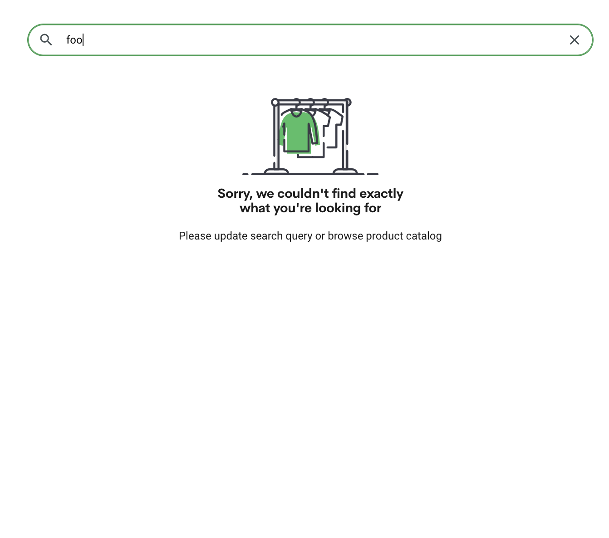
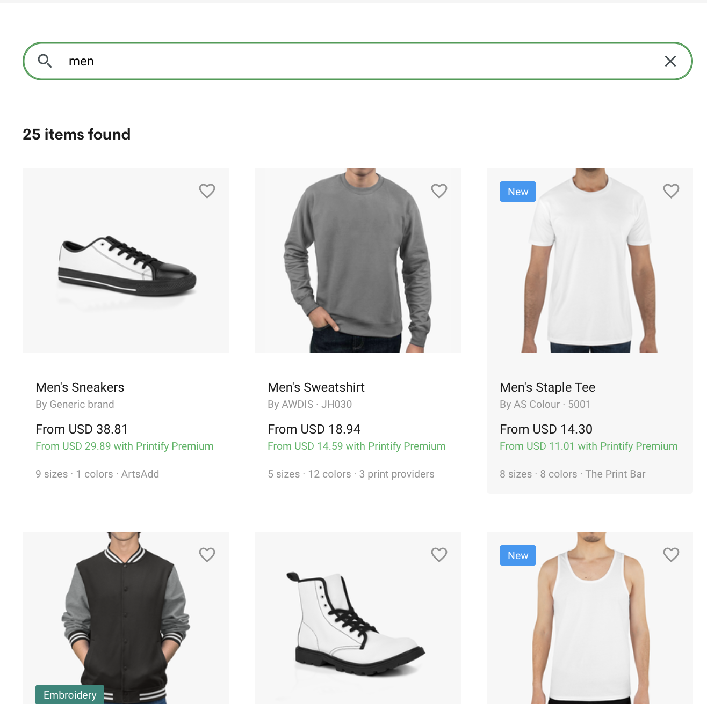

# Printify Frontend Homework 2.0

Your task is to create a Printify blueprints page MVP version in 1h 

## High level overview structure of the app
- Home is a page with a Blueprint card grid
- Home page has a search component
- Blueprint page has some details about the blueprint

## Mockups for inspiration
<small>These are only for a high level overview of the expected structure. Business logic is priority.</small>

#### Blueprint grid

#### Blueprint page

#### No results search

#### Found match search

## Requirements
1. Request are done using Printify mock API below
2. Clicking a blueprint should open the blueprint page
3. A blueprint page has details about the blueprint. (_In this case the API for 1 blueprint always returns the same blueprint i.e. the blueprint page will always have the same blueprint data_)
4. Blueprints grid can be filtered with a search input
5. No search result shows an empty search result message

## API
* Get all Blueprints API: https://run.mocky.io/v3/9ac6fd1c-e636-4f54-9764-5941632338c7
* Get 1 Blueprint API: https://run.mocky.io/v3/2a343350-d27f-461f-af63-c2247cde3251?id=${id}

## Notes
- Styles are not important. Focus on business logic.
- You don't have to finish 100% of the requirements.
- Googling is allowed
- Pair programming (with minimal help from us) is allowed